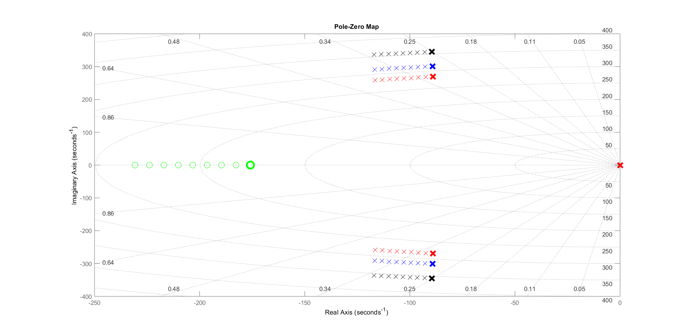

# Proyecto Global Integrador: Control de Accionamiento de CA con Motor Sincrónico de Imanes Permanentes

## Descripción
El estudio se centra en el modelado, diseño, simulación y análisis de desempeño de un **sistema de control 
automático de posición y movimiento** para un **accionamiento electromecánico de 4 cuadrantes**, compuesto
 por: máquina eléctrica de corriente alterna (CA) trifásica sincrónica con excitación por imanes permanentes
 (PMSM), alimentada por inversor trifásico desde fuente de CC; reductor de velocidad planetario de salida
 hacia la carga mecánica; y realimentación con 1 sensor de posición (encoder) en el eje del motor, más 3 
sensores de corriente instantánea de fases en la salida del inversor al estator.

## Resultados

### Análisis de Estabilidad a lazo abierto para Sistema LTI
En la siguiente imagen se observa el mapa complejo de los polos y ceros de el sistema LTI a lazo abierto:

Dado que los parámetros Jl (inercia del motor) y bl (coeficiente de fricción viscosa) son variables 
entre un mínimo y un máximo, y la resistencia eléctrica del estator se puede analizar como función de 
su temperatura, se muestra los valores que toman los polos y el cero al considerar los valores medios o 
nominales (en negro), mínimos (azul) y máximos (rojo) de Jeq y beq mientras la temperatura varía de 
40°C (marca de mayor espesor) a 115°C.
