# Proyecto Global Integrador: Control de Accionamiento de CA con Motor Sincrónico de Imanes Permanentes

## Descripción
El estudio se centra en el modelado, diseño, simulación y análisis de desempeño de un **sistema de control 
automático de posición y movimiento** para un **accionamiento electromecánico de 4 cuadrantes**, compuesto
 por: máquina eléctrica de corriente alterna (CA) trifásica sincrónica con excitación por imanes permanentes
 (PMSM), alimentada por inversor trifásico desde fuente de CC; reductor de velocidad planetario de salida
 hacia la carga mecánica; y realimentación con 1 sensor de posición (encoder) en el eje del motor, más 3 
sensores de corriente instantánea de fases en la salida del inversor al estator.

## Resultados

### Análisis de Estabilidad a lazo abierto para Sistema LTI

#### Determinación de polos y ceros

En la siguiente imagen se observa el mapa complejo de los polos y ceros de el sistema LTI a lazo abierto:

Dado que los parámetros Jl (inercia del motor) y bl (coeficiente de fricción viscosa) son variables 
entre un mínimo y un máximo, y la resistencia eléctrica del estator se puede analizar como función de 
su temperatura, se muestra los valores que toman los polos y el cero al considerar los valores medios o 
nominales (en negro), mínimos (azul) y máximos (rojo) de Jeq y beq mientras la temperatura varía de 
40°C (marca de mayor espesor) a 115°C.

#### Evaluación de estabilidad. Determinación de la frecuencia natural y el amortiguamiento

- Frecuencia natural del sistema a lazo abierto: **wn = 314.5047 rad/s**
- Amortiguamiento relativo del sistema a lazo abierto: **s = 0.2838** (Respuesta subamortiguada)

### Respuesta Dinámica en el Dominio del Tiempo para Sistema LTI
A continuación se expone la respuesta del sistema LTI a lazo abierto ante un escalón de tensión de 
**+19.596V** a los **0.1s**, seguido de un escalón de torque de carga de **+1.57Nm** a los **0.3s**.

Escalón de tensión             |  Escalón de torque de carga
:-------------------------:|:-------------------------:
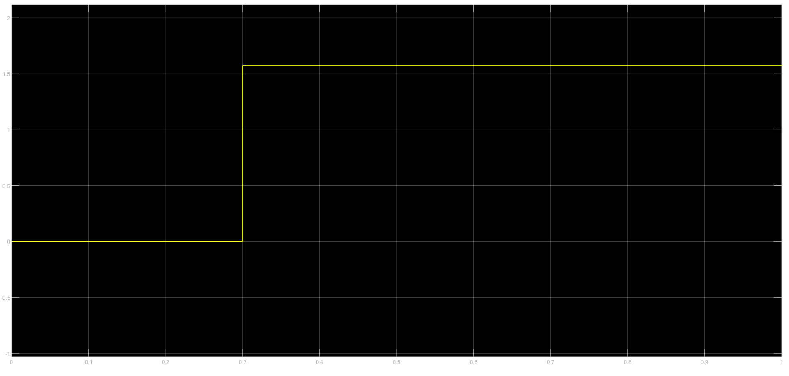  |  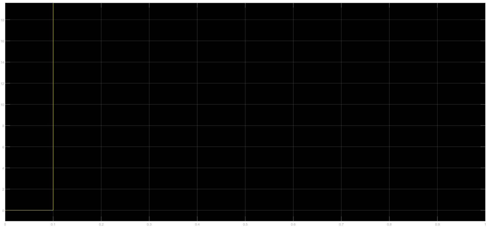

Tensión en componentes abc, aplicando transformación inversa de Park:

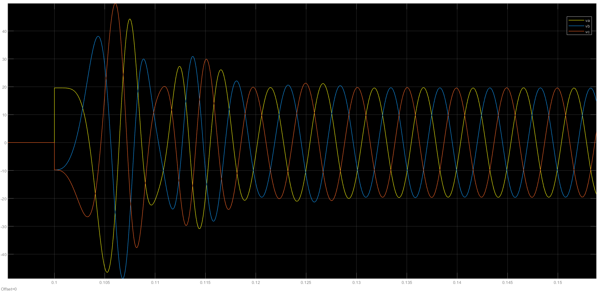

La respuesta del ángulo del eje motor en el tiempo es la siguiente:

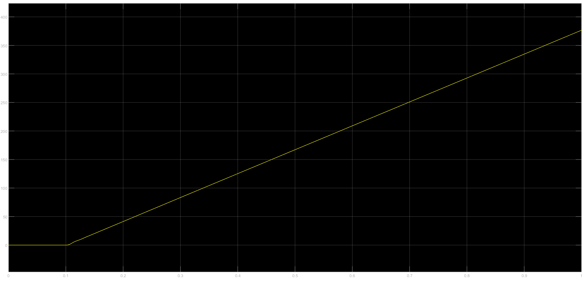

La respuesta de la velocidad angular del eje motor en el tiempo es la siguiente:

Respuesta de velocidad angular |  Ampliación de la respuesta en 0.3s (escalón de torque de carga)
:-------------------------:|:-------------------------:
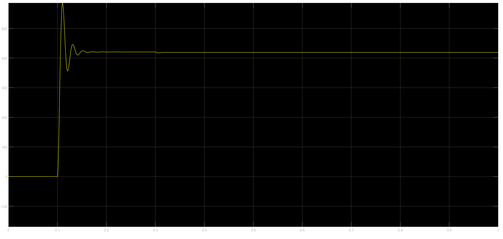  |  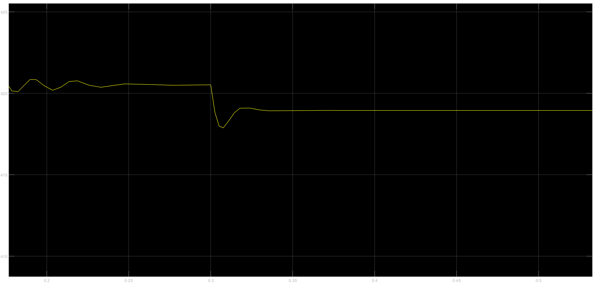

La corriente iq a la izquierda y a la derecha en componentes abc mediante transformación inversa de Park:

Corriente iq |  Corrientes de fase a, b y c
:-------------------------:|:-------------------------:
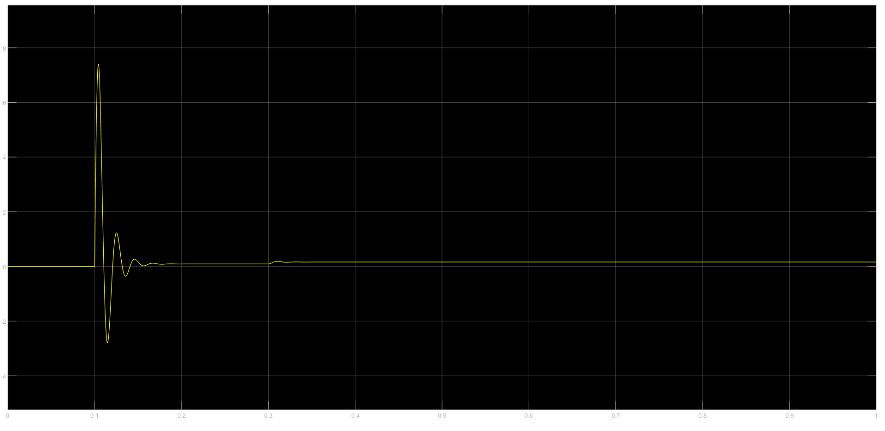  |  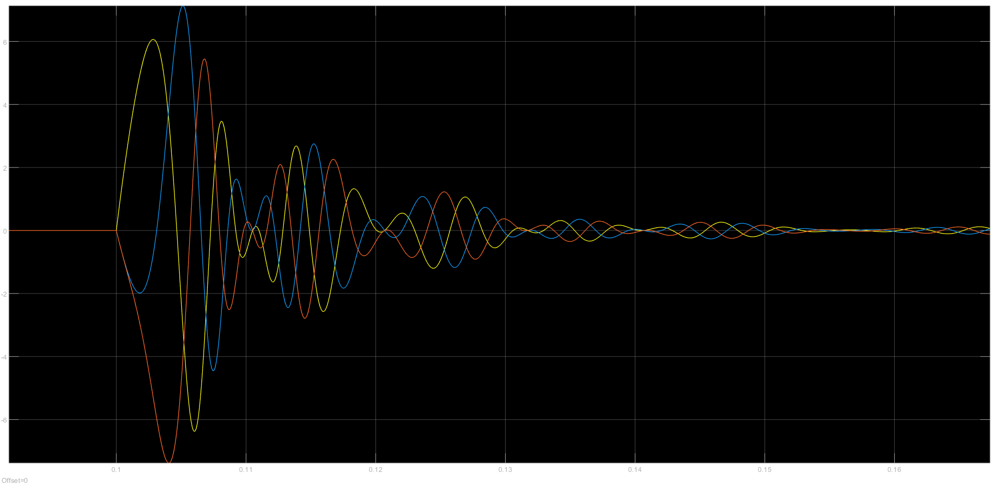

Se verificó que el valor de las componentes d y 0 de corriente tienen valor constante nulo, 
debido a las restricciones impuestas.

La respuesta del torque motor en el tiempo es la siguiente:

Respuesta del torque motor |  Ampliación de la respuesta en 0.3s (escalón de torque de carga)
:-------------------------:|:-------------------------:
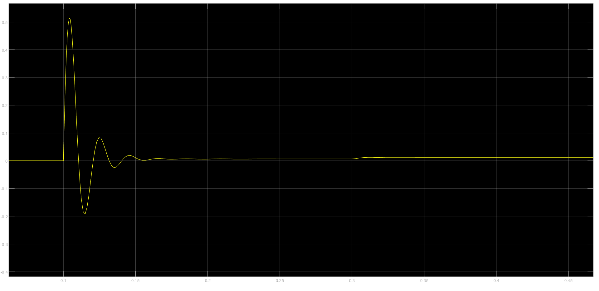  |  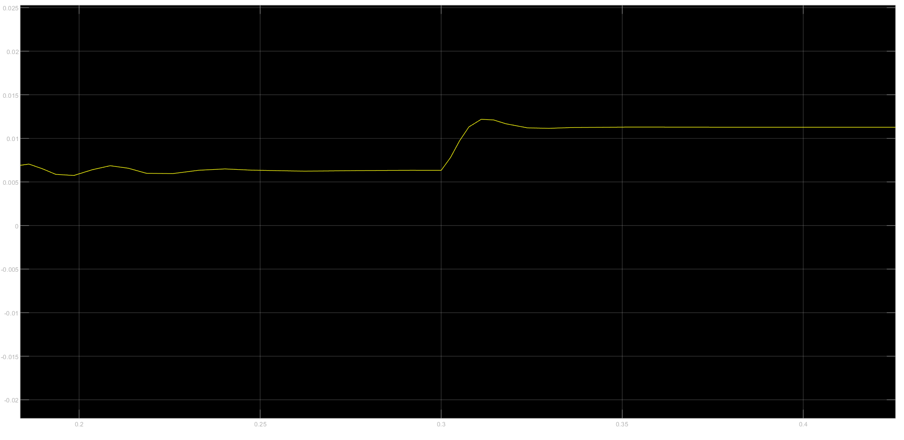

La temperatura del estator en el tiempo es la siguiente:

Temperatura del estator |  Temperatura en lapso de tiempo mayor
:-------------------------:|:-------------------------:
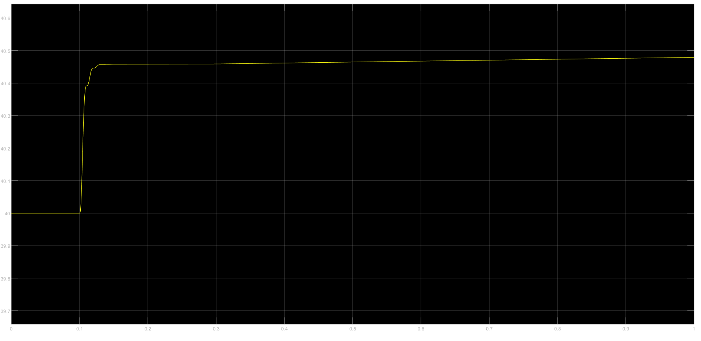  |  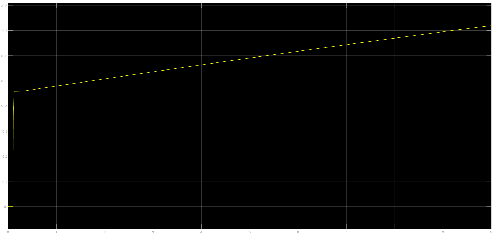

### Análisis de Controlabilidad del Sistema LTI

### Análisis de Observabilidad del Sistema LTI

